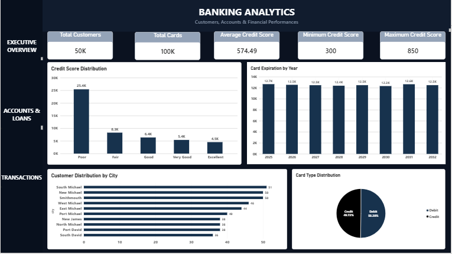
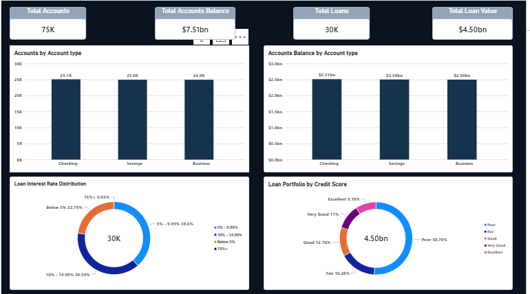
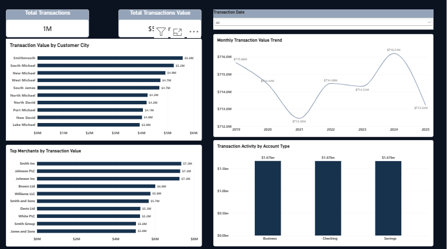

# Banking Customer Analytics

## Project Overview

Banking Customer Analytics is a data analytics project focused on understanding customer profiles, account balances, loan portfolios, card ownership, and transaction activity.

The project uses MySQL for data analysis and Microsoft Power BI to create an interactive dashboard that converts banking data into meaningful business insights.

## Business Objective

The main objectives of this project are to:

- Analyze customer credit profiles
- Understand account balances and account types
- Analyze loan portfolios and interest rates
- Identify transaction trends and activity
- Analyze card ownership and expiration
- Compare banking activity across cities and merchants
- Generate actionable business insights

## Dataset

The dataset contains seven main tables:

- Customers
- Accounts
- Loans
- Transactions
- Cards
- Merchants
- Branches

The analysis uses relationships between customers, accounts, loans, transactions, and merchants.

## Tools & Technologies

- **MySQL** – SQL analysis and data exploration
- **Microsoft Power BI** – Interactive dashboard and visualization
- **DAX** – Measures and calculated columns
- **Power Query** – Data preparation
- **GitHub** – Project documentation and portfolio

## Data Analysis

SQL was used to perform analysis across multiple areas, including:

- Customer and credit score analysis
- Account balance analysis
- Account type analysis
- Loan portfolio analysis
- Loan interest rate analysis
- Transaction trend analysis
- Transaction value by city
- Transaction activity by account type
- Merchant transaction analysis
- Card type and expiration analysis
- Customer account ownership analysis

Customers were categorized into five credit score groups:

| Credit Score | Category |
|---|---|
| Below 580 | Poor |
| 580–669 | Fair |
| 670–739 | Good |
| 740–799 | Very Good |
| 800+ | Excellent |

Loan interest rates were also grouped into categories to simplify analysis.

## Power BI Dashboard

The Power BI dashboard contains three pages.

### Executive Overview

Provides a high-level view of the banking portfolio through:

- Total Customers
- Total Accounts
- Total Account Balance
- Total Loans
- Total Loan Value
- Total Cards
- Total Transactions
- Total Transaction Value
- Customer distribution by city
- Credit score distribution
- Average, minimum, and maximum credit scores

### Accounts & Loans

Provides analysis of:

- Account Balance by Account Type
- Accounts by Account Type
- Loan Portfolio by Credit Score
- Loan Interest Rate Distribution
- Card Type Distribution
- Card Expiration by Year

### Transactions

Provides analysis of:

- Monthly Transaction Value Trend
- Transaction Value by Customer City
- Transaction Value by Account Type
- Top Merchants by Transaction Value
- Transaction Date filtering

## Key Insights

- Customer credit profiles vary across multiple credit score categories.
- Account balances differ across account types.
- Loan exposure varies across customer credit categories.
- Transaction activity changes over time.
- Transaction values differ across cities and account types.
- Card expiration trends can support renewal planning.

## Business Recommendations

- Monitor customer and account activity to identify valuable customer segments.
- Review loan exposure across different credit score categories.
- Compare account types using both balances and transaction activity.
- Monitor monthly transaction trends to identify changes in activity.
- Review high-value cities and merchants for potential business opportunities.
- Use card expiration trends to support proactive renewal planning.

## Project Files

| File | Description |
|---|---|
| `Banking_Customer_Analytics.sql` | SQL analysis and business queries |
| `Banking_Customer_Analytics_Documentation.pdf` | Detailed project documentation |
| `Executive_Overview.png` | Executive Overview dashboard preview |
| `Accounts_and_Loans.png` | Accounts & Loans dashboard preview |
| `Transactions.png` | Transactions dashboard preview |

> The Power BI `.pbix` file is not included because of GitHub file-size limitations.

## Skills Demonstrated

- SQL
- Data Analysis
- Data Cleaning
- MySQL
- Power BI
- DAX
- Data Visualization
- Dashboard Development
- Business Intelligence
- Business Insights

## Conclusion

This project demonstrates an end-to-end banking data analytics workflow using MySQL and Power BI.

It showcases the ability to analyze financial and customer data, develop interactive dashboards, identify business insights, and communicate findings through data visualization.
